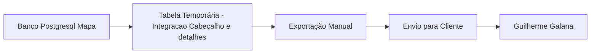

# 📋 Correções Jornada Amaggi - Documentação Técnica

## 🧪 Testes Realizados
**Ambiente:** Homologação  
**Status:** Em análise e desenvolvimento

---

## ✅ Checklist de Implementação

### 1. **Itens de Edição de Códigos Inativos**
#### 📍 Função: `PG/v4/inconsistencies_panel/fnc_get_inconsistencies_base.sql`

**🔧 Ações Necessárias:**
```sql
Linha 82: CTE base_journey (cdt_jornada)
Adicionar filtro fg_ativo = true

Linha 112: CTE new_journey (cdt_jornada)  
Adicionar filtro fg_ativo = true

Linha 220: JOIN cdt_funcionario 
Adicionar condição: AND f.fg_ativo = true

Linha 221: JOIN cdt_equipe
Adicionar condição: AND e.fg_ativo = true
```

**🎯 Objetivo:** Garantir que apenas registros ativos sejam considerados nos filtros de operador, equipe e jornada.

---

### 2. **Regra de cd_jornada validas**
#### 📍 Função: `PG/v4/inconsistencies_panel/fnc_get_inconsistencies_base.sql`

**🔧 Ações Necessárias:**
```sql
Linha 112: CTE new_journey (cdt_jornada)  
Adicionar overlaps para que quando o horário do cabeçalho estiver dentro do intevalo de uma jornada valida (ativa) ele sugira nos filtros

-- Sugestão
WHERE (jornada.dt_hr_inicial, jornada.dt_hr_final) OVERLAPS (mapa.dt_hr_inicial, mapa.dt_hr_final)
```

**🎯 Objetivo:** Garantir que apenas registros ativos sejam considerados nos filtros de operador, equipe e jornada.

---

### 3. **Otimização de Performance - Tempo de Resposta API**
#### 📍 Função: `PG/v4/inconsistencies_panel/fnc_get_inconsistencies_base.sql`

**🔧 Ações Necessárias:**
Analisar criação de índices na tabela ddn_mapa_operacao_evento. Campos prioritários: dt_hora (partição), cd_ordem_servico, fg_status_inconsistencia
```sql
-- Considerar índice composto:
CREATE INDEX idx_mapa_operacao_evento_filtros 
ON sgpa_map.ddn_mapa_operacao_evento (cd_cliente, cd_ordem_servico, fg_status_inconsistencia, dt_hora);
```

**📊 Funções para verificar:**
- `fnc_get_details_inconsistency` → Detalhes
- `fnc_get_grouped_inconsistencies` → Cabeçalho

---

### 4. **Novo Status de Inconsistência - "AF"**
#### 📍 Função: `PG/v4/processamento/fnc_gerar_ddn_mapa_operacao_evento.sql`

**🔧 Modificação na Linha 699 (CTE ds_result):** Adicionar nova condição para status "AF"
```sql
CASE 
    WHEN cd_id_talhao IS NULL OR cd_id_talhao = -1 
        THEN 'AF' 
    ELSE fg_status_integracao 
END AS fg_status_integracao
```

#### 📍 Função: `PG/v4/inconsistencies_panel/fnc_get_inconsistency_panel_status.sql`

**🔧 Ações Necessárias:**
```sql
-- Incluir novo status "AF" com nível de prioridade
INSERT INTO inconsistency_status_priority 
VALUES ('AF', 'Aguardando Fechamento', 3); -- Prioridade 3 (ajustável)
```

---

## 🔄 API Integração PostgreSQL - Solução Temporária

### 📋 Estratégia de Implementação:


**📌 Responsável:** Guilherme Galana (Gerente de Produto)  
**🚀 Status:** Implementação temporária em andamento

---

## 📝 Análise Técnica Detalhada

### 🔍 **Problema: Registros com fg_status_integracao Nulo**
**Situação:** Registros criados antes da implementação do campo estão com valor NULL

**✅ Solução Proposta:**
```sql
-- Script de correção para registros históricos
UPDATE ddn_mapa_operacao_evento 
SET fg_status_integracao = 'I' 
WHERE fg_status_integracao IS NULL 
AND dt_hora < '2024-01-01'; -- Data de corte a definir
```

### 🔍 **Problema: Regras de Processamento - cd_id_talhao**
**Situação:** Equipamentos podem sair do talhão para operações auxiliares

**✅ Solução Implementada:**
- Novo status "AF" para operações sem talhão definido
- Prioridade média para tratamento adequado

---

## 👥 Responsabilidades e Comunicação

| Item | Responsável | Status |
|------|-------------|---------|
| Códigos Inativos | Rayque (Dev 02) | Em análise |
| Otimização Performance | Equipe DBA | Pendente |
| Novo Status AF | Dev Backend | Em desenvolvimento |
| Integração Temporária | Guilherme Galana | Em andamento |

---

## ⚠️ Próximos Passos

1. **🔍 Validação das alterações de filtros ativos**
2. **📊 Análise de performance pós-implantação de índices**
3. **✅ Testes do novo status "AF" em homologação**
4. **🔄 Migração da solução temporária para definitiva**

---

## 📞 Contatos Chave

- **Vinicios:** Criação e validação de índices e implementação das modificações
- **Rayque (Dev 02):** Aplicará o novo fg_status no front-end
- **Guilherme Galana:** Coordenação com cliente e estratégia

---

**📅 Próxima Revisão:** 7 dias após implementação das correções  
**🎯 Métrica de Sucesso:** Redução de 50% no tempo de resposta das APIs

*Documentação atualizada em: 28/08/2025*
